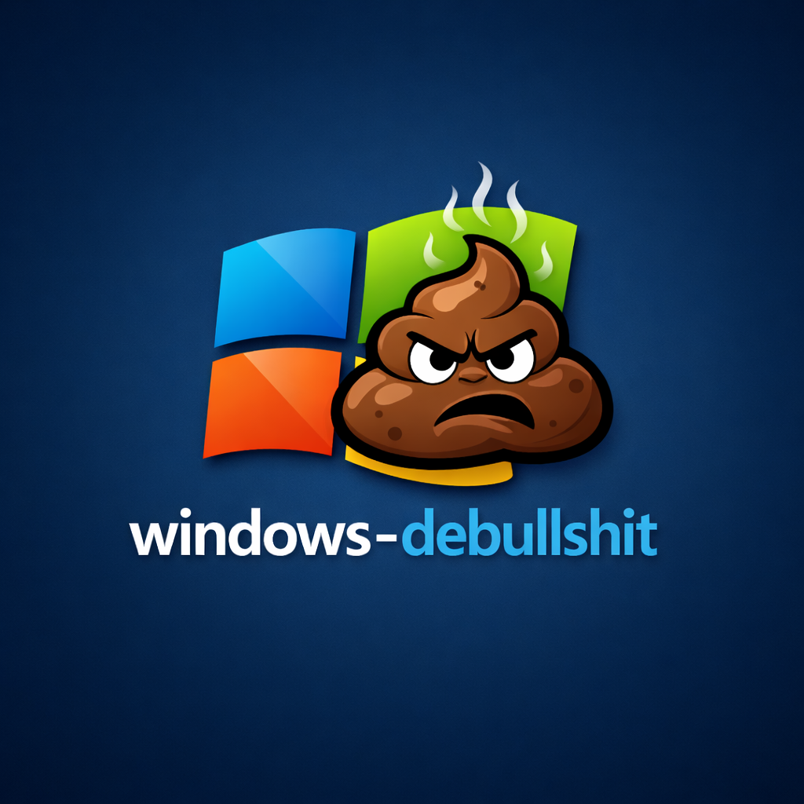

# windows-debullshit

A simple application for Windows to **run scripts to remove all bullshit from Microsoft's system** through a **simple graphical interface**.

The goal is to centralize common Windows tweaks into a clean, modular and easy to maintain launcher.

---

---

## Project goal

- Run `.bat` scripts quickly
- Organize scripts by **categories**
- Make maintenance and expansion easy
- Serve as a base for Windows debloat / hardening / privacy tweaks

---

## Features

- Removes data collection
- Removes ADs
- Removes useless apps
- Removes useless background services
- Installs open-source tools 
- Fully modular structure (drop a script → it appears in the app)

---

- Each **folder** becomes a **category**
- Each **.bat** file becomes a **button**
- No hard limit on categories or scripts

---

## Administrator execution

The application:
- starts **without admin privileges**
- requests **UAC only when a script requires it**

This provides:
- better user experience
- reduced risk
- correct Windows behavior

---

## How to use

1. Clone the repository
2. Create your categories inside the `scripts/` folder
3. Place `.bat` scripts inside the desired categories
4. Run:

